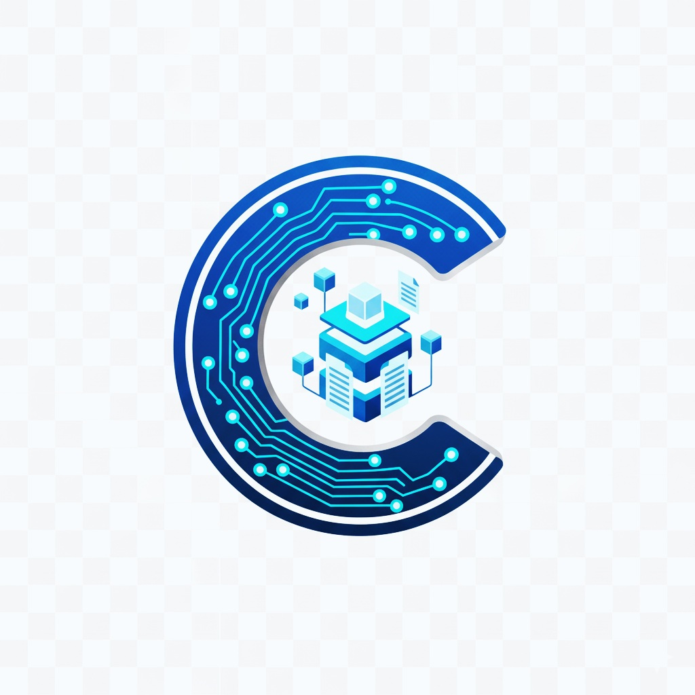
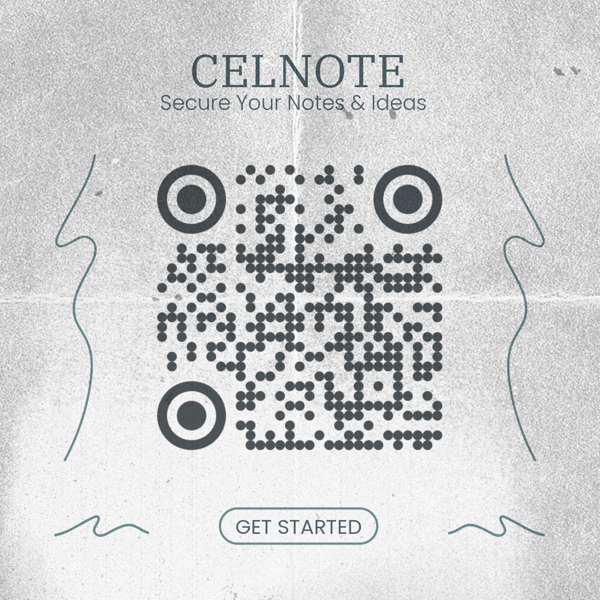

   
  <h1>🚀 CELTEN.NET 🚀</h1>
  
<strong>Fikirleriniz, Dosyalarınız ve Projeleriniz İçin Yeni Nesil Dijital Alanınız</strong>

  

    
  

  

     
    
     
    
  

---

**CELTEN**, not almanın basitliğini, bulut depolamanın gücünü ve proje yönetiminin esnekliğini tek bir platformda birleştiren modern bir web uygulamasıdır. İster bireysel kullanıcı olun ister bir ekibin parçası, Celten dijital hayatınızı organize etmenize ve fikirlerinizi hayata geçirmenize yardımcı olmak için tasarlandı. Tüm hakları Enes Kahraman'a aittir.

➡️ **Hemen Keşfedin: [https://celten.net](https://celten.net)**

---

## ✨ Neden CELTEN? İşte Öne Çıkanlar:

* **🧠 Zahmetsiz Not Alma:**
    * **Kişisel Not Defteriniz:** Fikirlerinizi, görevlerinizi veya ilham anlarınızı anında kaydedin, düzenleyin ve her yerden erişin.
    * **Proje Odaklı İşbirliği:** Ekip arkadaşlarınızla projeye özel notlar paylaşarak bilgi akışını kolaylaştırın.

* **💬 Anlık İletişim:**
    * **1'e 1 Özel Mesajlaşma:** Diğer kullanıcılarla anlık ve özel olarak sohbet edin. Canlı güncelleme desteği (polling) sayesinde sayfayı yenilemeden yeni mesajları görün.
    * **Gelen Kutusu:** Okunmamış mesajları takip edin ve sohbetlerinizi "gizleyerek" (tek taraflı silme) gelen kutunuzu temiz tutun.
    * **Projeye Özel Grup Sohbeti:** Her proje, tüm üyelere özel, canlı bir grup sohbeti alanına sahiptir. Fikirleri anında tartışın ve proje ilerlemesini hızlandırın.

* **🔔 Global Bildirim Sistemi (YENİ!):**
    * **Canlı Sayaç:** Yeni bir duyuru veya mesaj geldiğinde, bildirim butonundaki sayaç anında güncellenir.
    * **Yönetici Duyuruları:** Adminler, tüm kullanıcılara önemli duyurular (örn: "Sistem bakımı var") gönderebilir.
    * **Birleşik Modal:** Gelen kutunuzu, tüm okunmamış mesajları ve yönetici duyurularını tek bir modal üzerinden görüntüleyin.
    * **Kolay Temizlik:** Tek tıkla tüm mesaj bildirimlerini "okundu" olarak işaretleyin veya admin olarak yanlış gönderdiğiniz bir duyuruyu sistemden silin.

* **☁️ Sınırsız Google Drive Gücü:**
    * **Güvenli Dosya Depolama:** Önemli dosyalarınızı Google Drive hesabının güvenliğiyle saklayın ve yönetin.
    * **Merkezi Proje Dökümanları:** Tüm proje dosyalarınızı tek bir yerde toplayarak dağınıklığa son verin.
    * **Akıllı Kota Takibi:** Depolama alanınızı kolayca yönetin.

* **🎨 Hızlı Görselleştirme:**
    * Fikirlerinizi basit ve etkili çizim aracıyla anında dijital tuvale aktarın.

* **🤝 Takım Çalışması Yeniden Tanımlandı:**
    * **Esnek Proje Alanları:** Ekipleriniz veya konularınız için özel çalışma alanları yaratın.
    * **Kontrollü Katılım:** Yeni üyelerin katılımı için yönetici onayı sistemiyle projelerinizi güvende tutun. Admin ve Yöneticiler için anında katılım imkanı!
    * **Detaylı Yetki Yönetimi:** Süper Admin, Yönetici ve Proje Yöneticisi rolleriyle tam kontrol sağlayın.
    * **Sohbet Moderasyonu:** Proje yöneticileri ve adminler, proje sohbet geçmişini tek tıkla herkes için temizleyebilir.

* **🔒 Güvenlik ve Yönetim Önceliğimiz:**
    * **Yönetici Onaylı Sistem:** Platformunuza kimlerin katılacağını kontrol edin.
    * **Endüstri Standardı Şifreleme:** `bcrypt` ile güvende kalın.
    * **Giriş Güvenliği:** Brute force saldırılarına karşı koruma.
    * **Spam Koruması:** Mesajlaşma sisteminde hız sınırlaması (rate limiting) ile botları ve kötüye kullanımı engelleyin.
    * **Detaylı Yönetim Paneli:** Kullanıcıları, rolleri ve proje izinlerini kolayca yönetin.
    * **Gizlilik Odaklı Temizlik:** Süper Admin aracı ile (örn: 7 günden) eski tüm sohbet kayıtlarını sunucudan kalıcı olarak silin.

* **🎨 Sizin Tarzınız, Sizin Deneyiminiz:**
    * **Göz Alıcı Temalar:** Aydınlık ve Karanlık mod arasında geçiş yapın.
    * **Akıcı Arayüz:** Sayfa yenilemeden, hızlı ve modern bir kullanıcı deneyimi yaşayın.

---

## 🛠️ Teknik Detaylar (Meraklısına!)

Celten, güvenilirlik ve performansı bir araya getiren modern web teknolojileriyle inşa edildi:

* **Backend:** PHP (7.x Uyumlu). Güvenli dosya yazma işlemleri için Dosya Kilitleme (`flock`) kullanan JSON tabanlı veri yapısı.
* **Frontend:** HTML5, CSS3, Vanilla JavaScript (Fetch API, Canlı Güncelleme için Periyodik Polling).
* **Veri Yönetimi:** Sunucuda JSON Dosyaları.
* **Bulut Entegrasyonu:** Google Drive API.
* **UI Kütüphanesi:** SweetAlert2.

---

  
✨ Fikirlerinizi hayata geçirmeye hazır mısınız? ✨

  
  

    
  

  
<strong><a href="https://celten.net" target="_blank">CELTEN.NET</a></strong>

